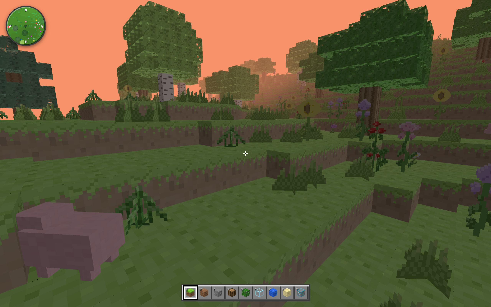

# ✨ CloudCraft


CloudCraft 是一个仿照经典游戏《我的世界 (Minecraft)》构建出来的一款网页版像素沙盒游戏。

在这里，你可以像在 Minecraft 里一样轻松地敲方块、下矿洞，随时随地在浏览器里盖起属于自己的小火柴盒！



---

## 🎮 游戏要素与核心机制

目前项目已经实现了以下沙盒游戏的基础要素和运行机制：

*   **世界生成与地形**：支持平原、森林、针叶林、沙漠、丛林、高原等多种生态群系。包含基于噪声算法生成的地下矿洞，以及铁矿、煤矿等矿石分布。
*   **物理与碰撞系统**：自研了基础的 AABB 碰撞物理系统，支持行走、疾跑、游泳、飞行等移动模式，具备自动跳跃、自动上台阶以及精确的碰撞检测。
*   **方块与生存机制**：支持方块的放置与破坏，破坏时有粒子飞溅效果。拥有背包和快捷栏管理（54格），加入了饥饿值、生命值机制，支持食用特定道具。
*   **简单的生态实体**：引入了具有简单寻路和避障 AI 的实体“猪”，击杀可获得掉落物。
*   **数据存档**：游戏进度（包括玩家位置、背包道具、世界中被修改的方块等）会自动保存在浏览器本地，支持存档的导入导出。
*   **界面与辅助工具**：左上角配备了小地图（可指引方向与生物位置）和 F3 调试面板（可查看 FPS、帧延迟、渲染线程、坐标等信息）。游戏支持中英文切换。
*   **移动端适配**：设计了像素风的虚拟摇杆、触屏视角旋转等交互控制，支持手机浏览器游玩。

---

## ⚡ 架构设计与性能优化

作为一个运行在浏览器中的 3D 游戏，项目在架构设计和性能优化上做了一些尝试：

*   **UI 与 3D 引擎状态解耦**：采用高低频分离设计。将高频 Tick 的 3D 渲染与物理引擎（60 FPS）运行在独立循环中，通过 Zustand 与低频的 React UI 状态进行异步同步，避免 UI 频繁更新导致游戏帧率抖动。
*   **Web Worker 多线程架构**：将地形噪声生成、区块数据填充以及网格剖分（Mesh 剖分）等 CPU 密集型任务移至后台 Worker 线程，主线程只负责渲染和用户交互，避免生成新区块时网页出现瞬时卡顿。
*   **空间裁剪与网格合并（Greedy Meshing）**：引入 3D 子区块（Sub-Chunk）管理机制，实现视线外以及深地底方块的智能裁剪剔除；结合贪婪网格算法合并同类材质的网格，最大化降低 WebGL 的 Draw Call。
*   **解耦的道具与交互系统**：采用基于上下文的多态分发机制驱动方块放置和道具使用，并在底层通过属性解析器注入模式消除模块间的循环依赖，便于后续扩展。
*   **轻量合成音效与粒子系统**：使用 Web Audio API 在代码中动态合成挖掘、放置等音效（无需加载大体积静态音频包），结合像素碎屑粒子散落特效，实现轻量化的物理交互反馈。

---

## 🚀 本地开发与运行

确保你本地安装了 [Node.js](https://nodejs.org/) 环境。

### 1. 克隆并安装依赖
```bash
git clone https://github.com/LingLingDayo/cloudcraft.git
cd cloudcraft
npm install
```

### 2. 启动本地开发服务
```bash
npm run dev
```
启动后在浏览器中打开命令行输出的本地地址（默认 `http://localhost:5402`）即可开始游玩。

### 3. 项目构建与打包
```bash
npm run build
```

### 4. 运行测试用例
*   **交互模式**（实时监听文件改动并重新运行相关测试）：
    ```bash
    npm run test
    ```
*   **单次运行**（执行全量测试）：
    ```bash
    npm run test:run
    ```

---

## 📄 开源协议

本项目采用 [MIT License](LICENSE) 开源协议。仅供学习交流使用，请勿用于商业用途。
