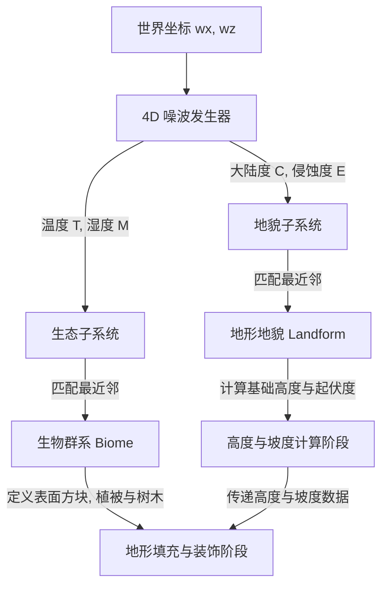

# 生态与地貌多维正交架构设计规范

本文档阐明了 WebCraft 世界生成中“生态群落（Biome）”与“地形地貌（Landform）”的多维正交解耦架构设计，用于指导后续新增地貌、生态类型以及调整地形生成算法。

---

## 💡 背景与核心理念

在早期设计中，地形高度计算与生态类型（Biome）完全耦合。这种设计限制了地貌与生态的组合（例如，如果想实现“沙漠山地”与“森林山地”，必须开发两个完全独立的生态类），造成大量的代码冗余和计算逻辑重复。

本架构参考经典的多维噪波地形生成模式，将**生态环境（气候/植被/表面材质）**与**地质构造（海拔/地形起伏度）**进行彻底的解耦，建立起正交组合的多维地形系统。

---

## 🛠️ 多维正交生成系统

地形与生态的决策由四个互相正交的噪波维度共同驱动，分为两个独立控制的子系统：

### 1. 维度划分
* **温度 (Temperature, $T$) 与 湿度 (Moisture, $M$)**：控制区域气候属性。
* **大陆度 (Continentalness, $C$) 与 侵蚀度 (Erosion, $E$)**：控制区域宏观与微观的地貌起伏。

### 2. 生态子系统 (Biome Subsystem)
仅负责**地表植被、树木生成概率、表面方块材质（例如草皮、沙子、红沙等）以及气候环境参数**。
* **生态匹配**：通过在二维温湿度空间（T, M）寻找距离当前坐标噪波值最近的生态群系，确定该坐标的气候归属。
* **主要职责**：
  * 定义地表和地表下特定深度内的方块填充规则。
  * 定义该生态下的植被生成逻辑（如生成什么花草、生什么树木、长树的概率等）。

### 3. 地貌子系统 (Landform Subsystem)
仅负责**宏观海拔高度、地形崎岖度与起伏曲线的计算**。
* **地貌匹配**：通过在二维地质空间（C, E）中匹配最接近的目标参数，定位当前坐标所属的地貌类型（如海洋、平原、丘陵、高原、山地等）。
* **主要职责**：
  * 根据大陆度与侵蚀度参数，以及噪波算法，计算出当前坐标对应的地表基础高度。

---

## 🏔️ 动态坡度检测与崖壁裸石机制

为了使地形更具真实感，系统引入了**动态坡度（Slope）检测机制**：

1. **坡度估算**：在计算地表高度时，利用高度在邻近坐标上的梯度（差分法）计算当前坐标的坡度。
2. **岩石暴露**：
   * 在地形填充阶段，当某列的坡度超过设定的崖壁阈值时，系统会覆盖生态群系默认的地表材质（如草地或泥土），转而填充裸露的石头或碎石材质。
   * 这使得极度陡峭的山脊或悬崖峭壁能够自然呈现裸露的岩石质感，避免了高山悬崖上依然覆盖厚厚草皮的视觉不协调。

---

## 🚀 架构扩展契约 (如何新增功能)

### 1. 新增一种地貌 (Landform)
若要增加新的地形特征（例如“峡谷地貌”或“盆地地貌”）：
1. 实现地貌控制接口。
2. 定义该地貌的中心大陆度（Target Continentalness）与侵蚀度（Target Erosion）目标值。
3. 编写该地貌的高度计算公式，并通过注册表将其注册。系统会自动在 (C, E) 空间中通过距离计算进行平滑过渡和无缝插值匹配。

### 2. 新增一种生态 (Biome)
若要增加新的群系特征（例如“雪原”或“热带草原”）：
1. 实现生态群系接口，移除任何高度逻辑。
2. 定义其中心温度（Target Temperature）与湿度（Target Moisture）目标值。
3. 编写其特有的表面方块填充、植被与树木的生成逻辑，并通过注册表注册。

---

## 🚨 核心开发红线 (设计约束)

* **职责单一性原则**：
  * **禁止**在生态（Biome）实现中编写任何与基础地形高度计算相关的噪波逻辑。高度计算必须且只能委托给地貌（Landform）计算。
  * **禁止**在地貌（Landform）中硬编码特定生态的专属方块。方块种类的决定权必须由生态与坡度机制共同决策。
* **坡度依赖性安全**：
  * 所有的坡度计算均在高度图生成阶段统一完成，并保存在流水线上下文中。后续阶段（基底填充、地表装饰等）应直接读取预估好的坡度值，禁止在装饰阶段再次调用噪波估算高度差，以保证生成效率。
