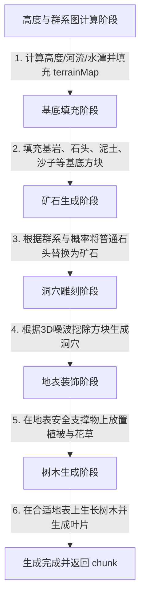

# 区块生成管道流水线开发规范

> [!NOTE]
> 该功能模块对应的源码路径为 `src/game/world/pipeline/`。

本文档阐明了在对 CloudCraft 的世界/区块（Chunk）生成系统进行功能扩展、优化或重构时，必须严格遵守的管道流水线（Pipeline）架构契约与设计约束。

---

## 💡 背景与设计初衷

为了将复杂的地形、群系、洞穴、地表植被及树木生成逻辑进行解耦，CloudCraft 的世界生成器采用了**管道流水线模式 (Pipeline Pattern)**。
每一批区块数据（Sub-chunk）的生成过程被拆分为多个具有单一职责的**阶段 (Stage)**，依序执行。这种解耦方式极大地提高了代码的可维护性，能够清晰、可控地处理不同阶段之间的依赖与状态传递。

---

## 🛠️ 核心架构与核心接口

流水线系统核心定义包括以下两个部分：

### 1. 流水线上下文 `ChunkPipelineContext`
用于在各个生成阶段之间传递和共享中间状态。
```typescript
export interface ChunkPipelineContext {
  cx: number; cy: number; cz: number;     // 当前 Sub-chunk 坐标
  worldStartX: number;                     // 世界起始坐标 X
  worldStartY: number;                     // 世界起始坐标 Y
  worldStartZ: number;                     // 世界起始坐标 Z
  chunk: Uint8Array;                      // 存储方块 ID 的扁平 3D 数组
  noise: ImprovedNoise;                   // 全局噪声生成器
  terrainMap: ChunkTerrainMap;            // 16x16 二维高度与属性图 (由高度计算阶段生成并共享)
  biomeMap: Biome[][];                     // 16x16 二维群系图
  generator: WorldTerrainProvider;         // 世界环境数据提供者接口引用 (解耦强绑定)
}
```

### 2. 流水线阶段接口 `ChunkPipelineStage`
每一个处理阶段都必须实现该接口：
```typescript
export interface ChunkPipelineStage {
  name: string;
  execute(context: ChunkPipelineContext): void;
}
```

---

## 🚀 流水线标准执行流程

区块数据生成默认以如下顺序构建并执行流水线阶段：



1. **高度与群系图计算**：计算 16x16 范围内的插值高度、调整高度、局部水面，并初始化 `terrainMap` 与 `biomeMap` 共享上下文。
2. **地形基底填充**：读取地形图，在对应的三维空间中填充基岩、石头、泥土、沙子和海水。
3. **矿石生成**：扫描当前区块的填充结果，将基底的普通石头（除世界最底层的基底外）依据策略替换为煤矿、铁矿、金矿或钻石矿等。
4. **洞穴雕刻**：利用 3D 噪声对地下区域进行挖空，将固态方块转为空气（因此矿石能在洞穴的岩壁上自然露出）。
5. **地表装饰**：在地表填充花草、双格植物等。在放置地表覆盖物时，需要结合实际方块状态或洞穴噪声预测（当支撑物处于其他 sub-chunk 时）进行地表支撑物的安全检测，以确保合理的放置。
6. **树木生成**：根据生物群系的树木概率和噪声，放置树干与树冠。

---

## 🚨 核心开发红线 (设计约束与避坑指南)

### 1. 严格的阶段执行依赖
每个阶段都是单向演进的。修改逻辑时，必须确保执行顺序不被打乱：
* 所有的地形属性计算（如判断某列是否为河流或水潭）**必须**在高度图计算阶段统一完成并保存到 `context.terrainMap`。
* 严禁在后续阶段中重新计算高度或噪波属性，必须直接从 `context.terrainMap[x][z]` 获取。

### 2. 边界写入安全防御
Sub-chunk 的方块数组长度是固定的 $16 \times 16 \times 16$ （即 4096 字节）。
* 在编写树木生成逻辑或大跨度结构生成逻辑时，所有三维坐标写入，**必须**严格检查局部索引的边界约束（即 X, Y, Z 各轴索引处于 `[0, 15]` 范围内），防止数组越界错误。
* 严禁在当前 Sub-chunk 逻辑中越界写入其他相邻 Chunk 的内存。若树木等结构跨越了区块边界，未覆盖的部分应当在其相邻 Sub-chunk 自身生成时，由流水线在该 Sub-chunk 内自然生成。

---

## 🧪 单元测试守护规范

任何对流水线基类、上下文接口、或各个阶段具体逻辑的修改：
1. **测试定位**：必须同步更新或扩展相关的流水线单元测试文件。
2. **测试运行**：在提交之前，请确保在本地运行对应模块的单元测试并全部通过，以保障 CI/CD 流程的稳定性。
