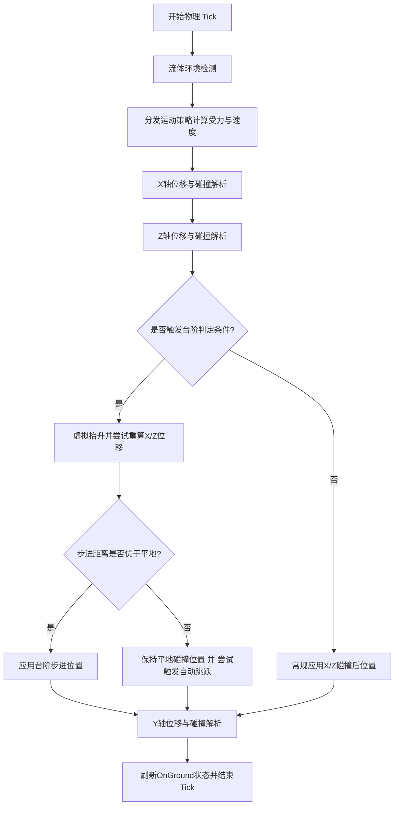

# 物理与碰撞系统设计及开发规范

> [!NOTE]
> 该功能模块对应的源码路径为 `src/game/physics/`。

本文档详述了 CloudCraft 物理与碰撞系统的模块化设计架构、核心算法执行流程以及开发过程中的关键红线约束。旨在为后续功能扩展或重构提供清晰的指导，确保物理交互的流畅度与工程代码的可维护性。

---

## 1. 物理系统核心架构

物理系统采用 **“自研体素物理主导 + 局部刚体物理引擎辅助”** 的混合架构，核心职责分层如下：

### 1.1 物理管理器 (Physics Manager)
- **职责**：整个物理系统的统一对外接口与生命周期 Tick 管理器。
- **设计**：
  - 对外（如游戏主循环、实体管理器）隐藏具体的碰撞算法与中间计算细节，只暴露实体尺寸、重力参数、流体状态检测及物理步进方法。
  - 内部组装并协调体素碰撞器、角色控制器与局部刚体引擎。

### 1.2 体素碰撞器 (Voxel Collider)
- **职责**：封装与沙盒体素方块直接交互的静态几何碰撞逻辑。
- **设计**：
  - 提供实体包围盒（AABB，Axis-Aligned Bounding Box）的计算方法。
  - 负责根据实体的包围盒范围，检索周围可能发生碰撞的体素方块。
  - 封装方块实体碰撞属性的判定逻辑，自动排除空气、流体及无碰撞体积的装饰性植被（如花草、树苗）。

### 1.3 角色运动控制器 (Character Controller)
- **职责**：控制玩家或生物等动态实体的物理运动流、状态判定与碰撞解析。
- **设计**：
  - 维护并装配运动策略，根据实体所处环境（流体、飞行、陆地）动态分发计算。
  - 严格控制物理时序，包含分轴位移、台阶步进、自动跳跃判定以及触地状态刷新。

### 1.4 运动策略模式 (Movement Strategy Pattern)
- **职责**：将不同运动状态（行走、游泳、飞行等）下的受力与速度计算彻底解耦。
- **设计**：
  - **统一上下文数据**：所有策略通过统一的上下文接口获取输入（包含位置、速度、按键状态、流体环境、空间方向等）。
  - **多态策略类**：
    - **陆地行走策略**：处理地面摩擦力、空中漂移阻力、重力加速度以及跳跃初速度。
    - **流体游泳策略**：处理流体阻力、浮力、液体中的上浮/下潜与水下跳跃。
    - **自由飞行策略**：实现无重力干扰的三维自由移动与惯性制动。

### 1.5 流体物理模块 (Fluid Physics)
- **职责**：提供液体环境下的流体力学辅助计算。
- **设计**：
  - 精确检测实体包围盒内的流体占比（如水面高度检测）。
  - 计算实体在流体中受到的浮力与运动阻力系数。

---

## 2. 物理 Tick 执行时序与算法流

在处理动态实体（如玩家、生物）的每 Tick 位移时，运动控制器必须遵循以下严格的执行时序。**AI 代理在此处修改代码时必须完全对齐该流水线：**



### 2.1 详细执行步骤说明

1. **状态检测**：
   - 检测实体的包围盒是否与流体块（如水）发生重叠，刷新 `inWater` 状态。
2. **力学计算分发**：
   - 根据当前的 `isFlying`、`inWater` 等物理状态，调用对应的运动策略计算受力。策略会更新实体的临时速度向量（Velocity）。
3. **X轴位移与碰撞解析**：
   - 将 X 轴位移应用到临时位置：`position.x += velocity.x * dt`。
   - 获取当前位置的 AABB 包围盒，检索相交的固态体素。
   - 若发生重合，根据运动方向计算重叠深度，将实体位置退回至相交边界，并将 X 轴速度 `velocity.x` 归零。
4. **Z轴位移与碰撞解析**：
   - 将 Z 轴位移应用到临时位置：`position.z += velocity.z * dt`。
   - 重复 AABB 碰撞检测，若重合则回退 Z 轴位置，并将 Z 轴速度 `velocity.z` 归零。
5. **台阶步进 (Step-up) 与自动跳跃 (Auto-jump) 判定**：
   - **触发前提**：实体在地面或流体中，未处于飞行状态，且在此 Tick 的 X 轴或 Z 轴上发生了碰撞。
   - **台阶步进算法**：
     1. 将实体位置重置回当前 Tick 的起始位置。
     2. 向上虚拟抬升一个步进高度（Step Height）。
     3. 在抬升后的高度，重新计算并应用 X 轴与 Z 轴的位移与碰撞限制。
     4. 将虚拟抬升后的实体向下压回至与方块顶部接触，得到台阶上移后的最终位置。
     5. 比较「台阶步进移动位置」与「平地受阻位置」到起始点的水平距离。
     6. 若台阶步进移动的水平距离更远，则应用该位置（速度 `velocity.y` 归零，视为顺利跨越台阶）；否则回退至平地碰撞位置，并判定是否满足自动跳跃（检测前方是否存在 1 格高、上方有 2 格空气的障碍）。
6. **Y轴位移与碰撞解析**：
   - 将 Y 轴位移应用到位置：`position.y += velocity.y * dt`。
   - 检测 Y 轴方向上的体素碰撞。
   - 若向上运动发生碰撞：退回位置，`velocity.y` 归零（撞头）。
   - 若向下运动发生碰撞：退回位置，`velocity.y` 归零，并将 `onGround` 标记设为 `true`（触地）。
7. **触地状态补偿**：
   - 若未发生碰撞，可通过将包围盒微幅向下延伸（如 0.01 格）进行虚拟投射检测，以确保在平地微幅抖动时 `onGround` 状态的平滑连续性。

---

## 3. 核心开发红线 (Design Bounds & Constraints)

### 3.1 严禁合并轴向判定
- **红线**：**绝对禁止一次性将三轴的速度或位移相加并进行统一碰撞判定。**
- **理由**：三轴合并判定会导致在顶角、斜对角移动时，AABB 无法准确区分碰撞法线，从而导致实体穿墙、卡死或在方块边缘剧烈抖动。必须严格遵循 X -> Z -> (台阶判定) -> Y 的分轴计算顺序。

### 3.2 高频状态与 UI 状态库隔离
- **红线**：**严禁在物理 Tick 的高频循环（60FPS+）中直接向 UI 状态库（如 React Zustand Store）推送高频物理状态（如精确坐标、即时速度）。**
- **规范**：如需在 UI 呈现调试信息，必须在外部模块采用节流（Throttle，如 100ms 间隔）或请求动画帧（RequestAnimationFrame）机制，将高频物理变量异步且限频地同步至状态库，防止主线程掉帧。

### 3.3 局部辅助刚体集成红线 (如 Rapier 物理引擎集成)
- **红线**：**严禁将整个沙盒世界的体素方块全量注册进辅助刚体物理引擎。**
- **规范**：
  - 必须采用**局部 Collider 动态注入机制**：以运动的刚体实体为中心，仅动态获取周围（如 $3 \times 3 \times 3$ 范围）的固态方块并注册为静态碰撞体，随着实体移动，超出范围的静态碰撞体必须立即销毁。
  - 辅助物理引擎仅用于托管投掷物、爆炸碎屑、粒子等局部刚体仿真，核心角色的移动碰撞控制必须始终保留在自研体素物理中。

---

## 4. 单元测试与验证规范

- **测试同步更新**：任何对物理碰撞规则、常量参数（如重力、阻力、步长）或计算方法的修改，**必须同步更新同级目录下的物理单元测试脚本**。
- **运行命令**：在提交任何物理代码修改前，必须在本地运行模块级测试：
  ```bash
  npm run test:run -- src/game/physics
  ```
- **通过契约**：所有测试用例必须 100% 通过，且无任何 TypeScript 类型校验错误。
